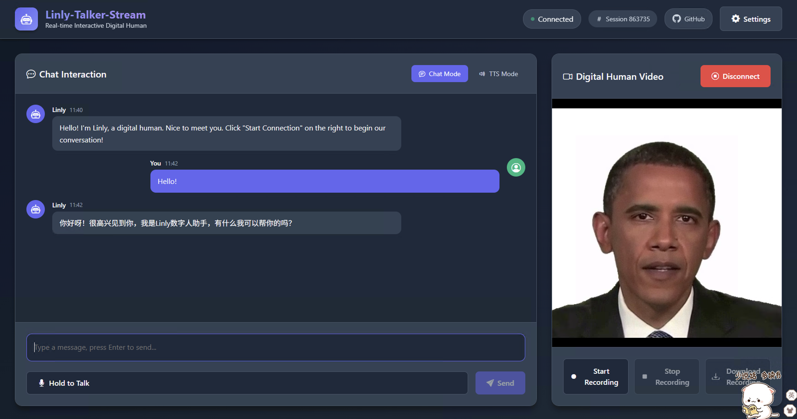

# Linly-Talker-Stream: Real-Time Streaming Conversational Digital Human System

<div align="center">
<h1>Full-duplex, low-latency, real-time interactive digital human framework</h1>

[](https://github.com/Kedreamix/Linly-Talker-Stream)


<br>

[**English**](./README.md) | [**简体中文**](./README_zh.md)

</div>

## News
**2026.02 Update** 📆

- Released **Linly-Talker-Stream**: the real-time streaming architecture version of [Linly-Talker](https://github.com/Kedreamix/Linly-Talker). Built on top of the original multimodal stack, it introduces a **WebRTC real-time transport + streaming pipeline** for low-latency audio/video interaction and a full-duplex conversation experience.

---

<details>
<summary>Table of Contents</summary>

<!-- TOC -->

- [News](#news)
- [Introduction](#introduction)
- [Demos & Showcase](#demos--showcase)
- [Roadmap (TODO)](#roadmap-todo)
- [Highlights](#highlights)
- [Project Structure Overview](#project-structure-overview)
- [Real-Time Interaction Pipeline](#real-time-interaction-pipeline)
- [Requirements](#requirements)
- [Quick Start (Recommended)](#quick-start-recommended)
- [Manual Installation Example (wav2lip)](#manual-installation-example-wav2lip)
- [Startup Methods](#startup-methods)
- [Configuration](#configuration)
- [Config Presets](#config-presets)
- [Models & Data](#models--data)
- [Backend APIs](#backend-apis)
- [FAQ](#faq)
- [References](#references)
- [Acknowledgements](#acknowledgements)
- [License](#license)
- [Star History](#star-history)

<!-- /TOC -->

</details>

## Introduction

## Why Linly-Talker-Stream?

Linly-Talker-Stream is the **real-time streaming architecture version** of [Linly-Talker](https://github.com/Kedreamix/Linly-Talker). It upgrades traditional turn-based QA into a more human-like **full-duplex conversational system**:

- 🎤 **Listen while speaking**: user speech and avatar playback can run in parallel.
- ⚡ **Low-latency transport**: real-time audio/video transmission via WebRTC.
- ✋ **Barge-in and interruption support**: more natural conversational rhythm.
- 🧩 **Modular multimodal pipeline**: ASR / LLM / TTS / Avatar modules are replaceable and extensible.

If you want to build AI assistants, digital human front desks, interactive guides, or live Q&A scenarios, this project can serve as a practical real-time interaction engineering baseline.

> On top of Linly-Talker’s multimodal pipeline (ASR / LLM / TTS / Avatar), this project references [LiveTalking](https://github.com/lipku/LiveTalking) for real-time communication design and performs a **streaming pipeline refactor**. Continuous optimization is planned.

## Demos & Showcase

> [!NOTE]
>
> - Linly-Talker demo video: https://www.bilibili.com/video/BV1rN4y1a76x/
> - Linly-Talker-Stream demo video: **TODO (to be added)**

Linly-Talker-Stream is positioned as the “real-time streaming version,” reusing and extending [Linly-Talker](https://github.com/Kedreamix/Linly-Talker)’s multimodal digital human capabilities:

- Project: [Linly-Talker](https://github.com/Kedreamix/Linly-Talker)
- If this project helps you, please also star [**Linly-Talker**](https://github.com/Kedreamix/Linly-Talker) to support upstream development.

**System Architecture**


**Web UI Preview**



## Roadmap (TODO)

- [ ] Introduce **Omni multimodality**, evolving from fixed `ASR + LLM + TTS` into a more complete end-to-end pipeline.
- [ ] Add server-side **VAD** to improve endpoint detection, interruption handling, and turn control stability.

> [!IMPORTANT]
> This project is under active iteration. PRs and Issues are welcome.

## Highlights

- **WebRTC real-time streaming playback** with low latency in browsers.
- **Full-duplex interaction (currently available)**: supports speaking and listening simultaneously. The current full-duplex implementation mainly relies on **browser speech recognition** (with built-in VAD/endpoint detection) for user-side speech detection and transcription, while avatar audio/video is continuously streamed via WebRTC.
- **Switchable avatar engines** via configuration:
  - `wav2lip` (2D)
  - `musetalk` (2D)
  - `ernerf` (3D)
  - `talkinggaussian` (3D)
- **Modular architecture** with isolated dependencies for on-demand installation and extension.

---

## Project Structure Overview

```text
Linly-Talker-Stream/
├── pyproject.toml                    # Root project config (core dependencies)
├── config/                           # Runtime config files (YAML)
├── scripts/                          # Environment setup / startup scripts
├── models/                           # Model weights
├── data/                             # Avatar assets / recorded files
├── web/                              # Vue frontend
└── src/
    ├── server/                       # Backend (WebRTC + APIs)
    ├── asr/                          # Speech recognition engines
    ├── llm/                          # LLM adapters
    ├── tts/                          # Speech synthesis engines
    └── avatars/                      # Avatar engines (2D/3D)
```

### Real-Time Interaction Pipeline

1. Browser captures microphone/camera input.
2. Speech enters the ASR and conversation pipeline.
3. LLM generates response text.
4. TTS outputs synthesized speech stream.
5. Avatar engine drives lip-sync and renders video.
6. WebRTC sends generated streams back to the browser in real time.

---

## Requirements

- **Python**: 3.10+
- **Node.js**: 16+
- **uv**: recommended Python package manager ([installation docs](https://docs.astral.sh/uv/getting-started/installation/))
- **Browser**: Chrome / Edge recommended (remote microphone access usually requires HTTPS)

---

## Quick Start (Recommended)

```bash
# 1) Clone repository
git clone https://github.com/Kedreamix/Linly-Talker-Stream.git
cd Linly-Talker-Stream

# 2) One-click environment setup (auto install uv + create .venv + install dependencies)
bash scripts/setup-env.sh wav2lip

# 3) Configure API key (default using Alibaba Cloud Bailian's Qwen-plus interface)
export DASHSCOPE_API_KEY="your_api_key_here"

# 4) One-click start backend + frontend
bash scripts/start-all.sh config/config_wav2lip.yaml
```

Open in browser: `http://localhost:3000`

> **Notes**
> - Supported avatars: `wav2lip`, `musetalk`, `ernerf`, `talkinggaussian`
> - DashScope API key application: [Alibaba Cloud Bailian Console](https://bailian.console.aliyun.com) (free quota available)
> - For detailed installation of uv / Node.js, see [FAQ.md](./FAQ.md)

---

## Manual Installation Example (wav2lip)

```bash
# Backend dependencies
uv venv --python 3.10.19
uv sync
uv pip install -e src/avatars/wav2lip/

# Frontend dependencies
cd web && npm install && cd ..

# Environment variable
export DASHSCOPE_API_KEY="your_api_key_here"

# Start services
bash scripts/start-all.sh config/config_wav2lip.yaml
```

### Generate HTTPS Certificates (Recommended)

Microphone access for remote usage requires HTTPS:

```bash
bash scripts/create_ssl_certs.sh
```

Then set `app.ssl: true` in config and access with `https://localhost:3000`.

### Install Other Avatar Modules

```bash
# TalkingGaussian
uv pip install -e src/avatars/talkinggaussian/
uv pip install -e src/avatars/talkinggaussian/submodules/diff-gaussian-rasterization/ --no-build-isolation
uv pip install -e src/avatars/talkinggaussian/submodules/simple-knn/ --no-build-isolation
uv pip install -e src/avatars/talkinggaussian/gridencoder/ --no-build-isolation

# MuseTalk (requires additional dependencies and post-processing)
uv pip install chumpy==0.70 --no-build-isolation
uv pip install -e src/avatars/musetalk/
uv run mim install mmengine
uv run mim install mmcv==2.2.0 --no-build-isolation
uv run mim install mmdet==3.1.0
uv run mim install mmpose==1.3.2
bash scripts/post_musetalk_install.sh
```

## Startup Methods

### A. Start Backend and Frontend Separately

```bash
# Backend
bash scripts/start-backend.sh config/config_wav2lip.yaml
# or
uv run python src/server/app.py --config config/config_wav2lip.yaml

# Frontend
bash scripts/start-frontend.sh config/config_wav2lip.yaml
```

### B. Start with One Command

```bash
bash scripts/start-all.sh config/config_wav2lip.yaml
```

Default ports:
- Backend: `http://localhost:8010`
- Frontend: `http://localhost:3000`

---

## Configuration

All configs are in `config/*.yaml`. Common fields:

- `app.listenport`: backend port (default `8010`)
- `app.ssl`: whether to enable HTTPS (recommended for remote recording)
- `model.type`: avatar type (`wav2lip` / `musetalk` / `ernerf` / `talkinggaussian`)
- `tts.type`: TTS engine (e.g. `edgetts`, `azuretts`, `gpt-sovits`, `cosyvoice`)
- `asr.mode`: `browser` (recommended) / `server` / `auto`
- `llm.*`: LLM config (defaults to Qwen-plus on DashScope)

Default config reads:

```bash
export DASHSCOPE_API_KEY="YOUR_KEY_HERE"
```

> ⚠️ **Important**: LLM features require an API key from [Alibaba Cloud Bailian](https://bailian.console.aliyun.com), which provides free usage quota.

## Config Presets

The repository provides runnable config presets with modular installation:

| Status | Config File | Avatar Type | 2D/3D | One-Click Setup Command |
|------|---------|-----------|------|------------|
| ✅ | `config/config_wav2lip.yaml` | wav2lip | 2D | `bash scripts/setup-env.sh wav2lip` |
| ✅ | `config/config_musetalk.yaml` | musetalk | 2D | `bash scripts/setup-env.sh musetalk` |
| ✅ | `config/config_talkinggaussian.yaml` | talkinggaussian | 3D | `bash scripts/setup-env.sh talkinggaussian` |
| ⬜ | `config/config_ernerf.yaml` | ernerf | 3D | `bash scripts/setup-env.sh ernerf` |

Recommended engine switch procedure:

1. Install the target avatar module.
2. Start with matching `config/config_*.yaml`.
3. Verify model and asset paths in the config.

## Models & Data

### Quick Download

| Avatar | Type | Download Method |
|--------|------|---------|
| **Wav2Lip** | 2D | Download `wav2lip256.pth` + `wav2lip256_avatar1.tar.gz` from [Quark Drive](https://pan.quark.cn/s/83a750323ef0) (from [LiveTalking](https://github.com/lipku/LiveTalking)) |
| **MuseTalk** | 2D | `bash scripts/download_musetalk_weights.sh` |
| **TalkingGaussian** | 3D | 🔗 TBD |
| **ER-NeRF** | 3D | 🔗 TBD |

**Placement Instructions**

```bash
# Wav2Lip
# 1. Rename wav2lip256.pth to wav2lip.pth and place it in models/
# 2. Extract wav2lip256_avatar1.tar.gz to data/avatars/

# MuseTalk (auto download to correct path)
bash scripts/download_musetalk_weights.sh

# TalkingGaussian
# Extract talkinggaussian_obama.tar.gz to data/avatars/
```

> 💡 **Advanced usage**: for custom avatar assets, directory structure details, and config path setup, see [FAQ.md](./FAQ.md).

---

## Backend APIs

Main endpoints (see `src/server/server.py`):

- `POST /offer`: WebRTC SDP handshake
- `POST /human`: text dialogue (`type=chat` calls LLM, `type=echo` for text playback)
- `POST /asr`: upload audio → ASR → LLM → drive avatar speech
- `POST /humanaudio`: upload audio file to drive avatar speech
- `POST /record`: start/stop recording
- `GET /download/{filename}`: download recorded files
- `GET /health`: health check

## FAQ

See [FAQ.md](./FAQ.md).

---

## References

- WebRTC backend: [aiortc](https://github.com/aiortc/aiortc) + [aiohttp](https://github.com/aio-libs/aiohttp)
- Frontend: [Vue 3](https://vuejs.org/) + [Vite](https://vitejs.dev/)
- Speech: [Whisper](https://github.com/openai/whisper), [FunASR](https://github.com/alibaba-damo-academy/FunASR), [edge-tts](https://github.com/rany2/edge-tts)
- Avatar driving: [Wav2Lip](https://github.com/Rudrabha/Wav2Lip), [MuseTalk](https://github.com/TMElyralab/MuseTalk), [ER-NeRF](https://github.com/Fictionarry/ER-NeRF), [TalkingGaussian](https://github.com/Fictionarry/TalkingGaussian)
- Interactive systems: [Linly-Talker](https://github.com/Kedreamix/Linly-Talker), [LiveTalking](https://github.com/lipku/LiveTalking), [OpenAvatarChat](https://github.com/HumanAIGC-Engineering/OpenAvatarChat)

You can also refer to [Linly-Talker](https://github.com/Kedreamix/Linly-Talker) and [LiveTalking](https://github.com/lipku/LiveTalking) for additional context.

## Acknowledgements

- [LiveTalking](https://github.com/lipku/LiveTalking): provided great references for real-time avatar/WebRTC streaming pipelines; this repo refactors and extends that design.
- [Linly-Talker](https://github.com/Kedreamix/Linly-Talker): the upstream multimodal digital human system integrated into this real-time streaming version.

## License

This repository uses **Apache License 2.0** (consistent with [LiveTalking](https://github.com/lipku/LiveTalking)).

> [!CAUTION]
> Please comply with local laws and regulations when using or deploying this project (copyright, privacy, data protection, etc.).

See `LICENSE` and `NOTICE` for details.

## Star History

[](https://star-history.com/#Kedreamix/Linly-Talker-Stream&Date)
